<p align="center">
  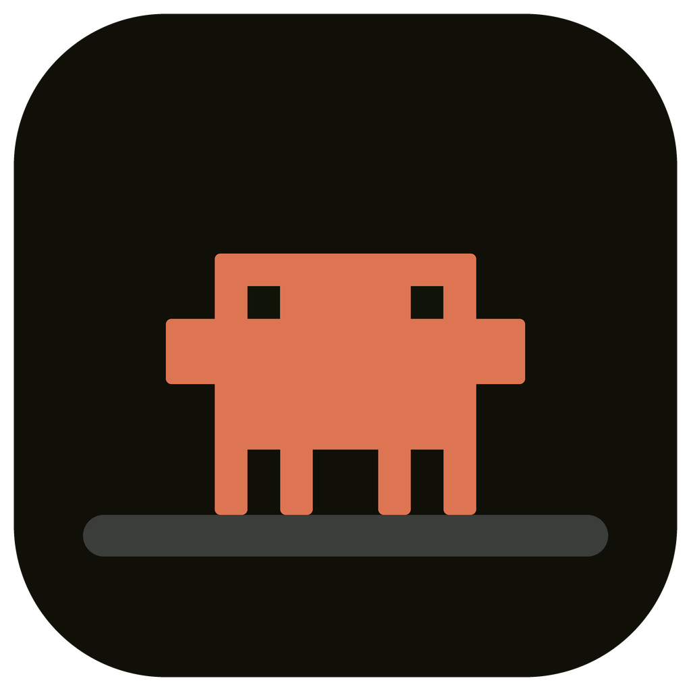
</p>

<h1 align="center">Perch</h1>

<p align="center">
  <strong>จอเล็กๆ ที่เกาะอยู่บนโต๊ะ</strong> — คอยบอกว่า agent ที่รันอยู่กำลังทำอะไร
  โดยไม่ต้องเสียพื้นที่หน้าจอให้มัน
</p>

<p align="center">
  
  
  
  
  
  <a href="LICENSE"></a>
</p>

<p align="center">
  🌐 <a href="README.md">English</a> · <strong>ไทย</strong>
</p>

<p align="center">
  <a href="#จอบอกอะไรบ้าง">จอบอกอะไรบ้าง</a> ·
  <a href="#ของที่ต้องมี">ของที่ต้องมี</a> ·
  <a href="#1-เอา-repo-กับคอมไพเลอร์-swift-มาก่อน">เริ่มใช้งาน</a> ·
  <a href="#เคส">เคส</a> ·
  <a href="#แก้ปัญหา">แก้ปัญหา</a>
</p>

<p align="center">
  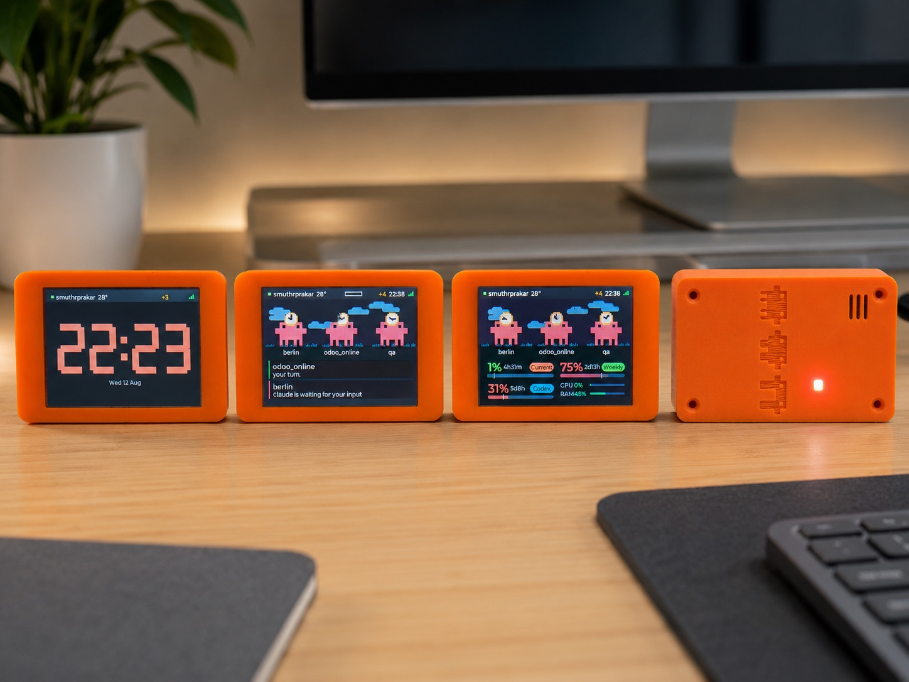
</p>

<p align="center"><sub>ซ้ายไปขวา: หน้านาฬิกาที่มันกลายเป็นหลังสามทุ่ม · session ที่รอคำตอบจากคุณ ·
โควตากับภาระเครื่อง · ฝาหลังที่มีไฟสถานะและลายสามสายพันธุ์เซาะไว้</sub></p>

> **อ่านก่อนเริ่ม**
> - **ใช้ได้บน macOS เท่านั้น** ตัวที่คุยกับ Claude Code เป็นแอปแถบเมนูภาษา Swift สำหรับ macOS 14 ขึ้นไป
>   ไม่มีตัวสำหรับ Linux หรือ Windows และ firmware เพียงลำพังทำอะไรไม่ได้ถ้าไม่มีแอปนี้
> - **ไม่ใช่ของทางการ** เป็นโปรเจกต์งานอดิเรกส่วนตัว ไม่ได้สังกัดหรือได้รับการรับรองจาก Anthropic
>   ชื่อ "Claude" และ "Claude Code" เป็นของพวกเขา
> - **ใช้ตามสภาพ** การแฟลชจะเขียนทับทุกอย่างที่อยู่บนบอร์ด และคุณทำด้วยความเสี่ยงของตัวเอง
>   ไม่มีการรับประกันใดๆ ดู [LICENSE](LICENSE)
> - การดึงโควตาจาก claude.ai เป็นทางเลือก และต้องใช้ credential ของบัญชี
>   อ่าน [ขั้นที่ 5](#5-โควตาบนจอ) ให้จบก่อนเปิดใช้

อุปกรณ์ตั้งโต๊ะที่บอกว่า agent ที่คุณรันอยู่กำลังทำอะไร ตัวเหลี่ยมๆ อาศัยอยู่บนจอเล็กๆ ข้างคีย์บอร์ด
ตัวละหนึ่ง session และคนละสายพันธุ์ตามแต่ละ agent — พิมพ์ตามตอนมันพิมพ์ โบกมือตอนมี session
รอคำตอบจากคุณ และดีใจตอนบิลด์เสร็จ แถบล่างคือโควตาการใช้งาน แถบบนคือเวลากับสภาพอากาศ
และหลังสามทุ่มทั้งจอจะกลายเป็นนาฬิกา

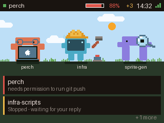 

*บอร์ด กับแอปแถบเมนูที่ป้อนข้อมูลให้มัน*

ไม่มีอะไรวิ่งออกนอกวงเน็ตของคุณ แอปบนแถบเมนูของ Mac อ่าน hook ของ Claude Code แล้วส่งข้อมูล
ก้อนเล็กๆ ไปที่บอร์ดผ่าน Bluetooth LE — และถ้าตั้ง Wi-Fi ไว้ ก็เดินทางบน LAN ของคุณเองแบบเข้ารหัส
ตอน Bluetooth เงียบ ส่วนบอร์ดไม่เคยคุยกับ claude.ai เลย

## จอบอกอะไรบ้าง

**ตอนมี session ทำงานอยู่**

| กำลังยุ่ง | รอคุณอยู่ | เสร็จแล้ว |
|:--|:--|:--|
|  | 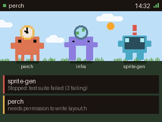 | 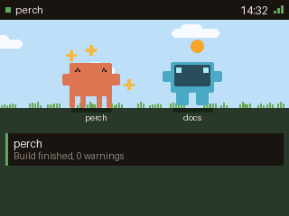 |
| มากสุดสาม session พร้อมเครื่องมือที่แต่ละตัวใช้อยู่ | session หยุดแล้วรอคำตอบจากคุณ | มาสคอตดีใจกับเทิร์นที่เพิ่งจบ |

**ตอนไม่มีอะไรเกิดขึ้น**

| ว่าง | ไม่มี session | ออฟไลน์ |
|:--|:--|:--|
| 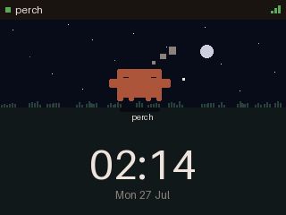 | 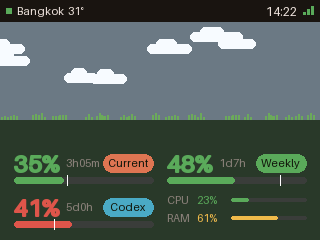 | 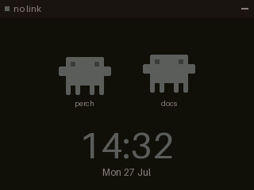 |
| มี session เดียวและมันหลับอยู่ ฟ้ากลางคืนกับนาฬิกา | มาสคอตเดินเล่น มีนาฬิกาและวันที่ | Mac อยู่ไกลเกินไป หรือแอปไม่ได้เปิดอยู่ |

**โควตา**

| ปกติ | ใกล้เต็ม | ยังไม่รู้ค่า |
|:--|:--|:--|
| 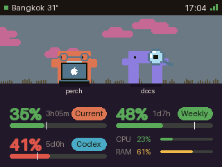 | 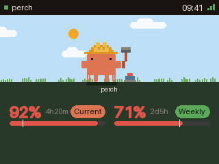 | 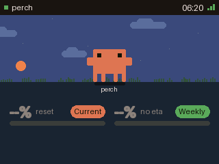 |
| หน้าต่าง 5 ชั่วโมงปัจจุบันกับรายสัปดาห์ | ใกล้ชนเพดาน ขีดเล็กๆ บอกจังหวะการใช้เทียบกับเวลา | ขึ้น `--` ไม่เดาค่าให้ ตอนที่ยังไม่มีตัวเลขมาถึง |

**ตอนเดินบน Wi-Fi**

| ยังทำงานอยู่ | ไม่มีใครป้อน |
|:--|:--|
| 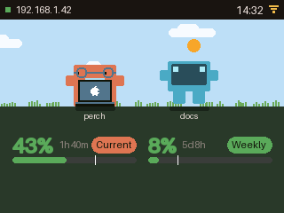 | 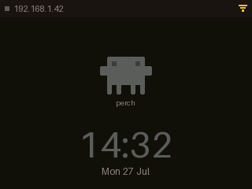 |
| Bluetooth หลุดไปแล้ว ป้ายบนแถบจึงเปลี่ยนเป็น IP ของบอร์ดและไอคอนเป็นคลื่น แต่ snapshot ยังเดินทางมาถึงอยู่ เข้ารหัสมาทางเครือข่าย | บอร์ดอยู่บนเน็ตแต่ไม่มีอะไรจะแสดง — Mac Sleep หรือแอปไม่ได้เปิดอยู่ |

**ตอนกลางคืน และตอนที่คุณแตะมัน**

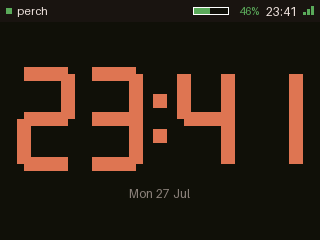

สามทุ่มถึงเจ็ดโมงเช้า จอเหลือแค่นาฬิกา ไม่มีมาสคอต ไม่มีท้องฟ้า ไม่มีสนามหญ้า ไม่มีการเตือน
และไฟ LED บนบอร์ดดับสนิท — session ยังทำงานอยู่และการเตือนยังมาถึงตามปกติ มันแค่รอจนเช้า
ที่เป็นแบบนี้เพราะมันไว้ตั้งในห้องนอน จอบอกสถานะที่ส่องสว่างทั้งห้องตอนตีสามคือจอที่จะถูกถอดปลั๊ก
แตะจอแล้วมันกลับมาเป็นปกติ 15 วินาที แล้วค่อยกลับไปนอนต่อ

ตัวเลขเป็นสีเดียวกับลำตัวมาสคอตแทนที่จะเป็นสีขาว ไม่ใช่แค่เพราะมันเป็นสีประจำโครงการ —
สีอุ่นมีองค์ประกอบสีน้ำเงินน้อยกว่ามาก ซึ่งเป็นช่วงคลื่นที่รบกวนการนอนมากที่สุด
ความสว่างเท่ากัน แต่เป็นแสงคนละแบบ

นอกช่วงนั้น ไฟหลังจอจะหรี่ลงเองหลังไม่มีใครแตะหนึ่งนาที และสว่างขึ้นทันทีที่แตะ
การแตะยังใช้พลิกไปดูหน้าโควตาได้ด้วย

## สาม agent สามสายพันธุ์

Perch ไม่ถามว่าคุณใช้ agent ตัวไหน — มันเฝ้าดูทั้งสามตัวแล้วแสดงตัวที่เจอ
ซิลลูเอ็ตต่างกันไม่ใช่แค่สีต่างกัน เพราะมองจากอีกฝั่งห้อง สายตาอ่าน *รูปทรง* ออกก่อนอ่าน *สี*

| | หน้าตา | ตรวจเจอด้วย | ต้องตั้งค่าไหม |
|:--|:--|:--|:--|
| **Claude Code** | ตัวเหลี่ยม สี่ขา สีส้ม | ระบบ hook ของมัน | กดครั้งเดียวในเมนูเฟือง |
| **Codex CLI** | จอบนสองขา สีฟ้า | อ่านไฟล์ rollout ที่มันเขียนอยู่แล้ว | **ไม่ต้อง** |
| **Antigravity** (`agy`) | ซุ้มโค้งที่มองทะลุได้ สีม่วง | อ่าน `~/.gemini/antigravity-cli` | **ไม่ต้อง** |

Codex กับ Antigravity ไม่มีระบบ hook ให้ติดตั้ง Perch จึงไปอ่านไฟล์ที่มันเขียนไว้อยู่แล้ว
ไม่ต้องตั้งค่าอะไร ไม่แตะของของมันสักไฟล์ และไม่ได้ขอให้มันรายงานอะไรทั้งนั้น —
ถ้าเครื่องมือนั้นอยู่ในเครื่องและกำลังทำงาน มันจะโผล่บนจอเอง

## ของที่ต้องมี

**ฮาร์ดแวร์**

- บอร์ด **ESP32-2432S028R** หรือที่เรียกกันว่า "Cheap Yellow Display" จอ 2.8" 320x240
  ราคาราวๆ 300 บาท ทดสอบกับ ESP32-D0WD-V3 rev 3.1 แฟลช 4 MB ไม่มี PSRAM
- **สาย USB ที่ส่งข้อมูลได้** สำหรับพอร์ต micro-USB ของบอร์ด สายชาร์จอย่างเดียวจะไม่ขึ้นพอร์ต

<a href="https://s.shopee.co.th/4qEXaCOFvu"></a>

<sub>ปุ่มนี้เป็นลิงก์ affiliate ของ Shopee — กดซื้อผ่านลิงก์นี้ราคาเท่าเดิม
แต่มีค่าคอมมิชชันเล็กน้อยกลับมาที่โปรเจกต์ ถ้าจะซื้อจากร้านไหนก็ได้เหมือนกัน
ขอแค่เป็น ESP32-2432S028R</sub>

**เครื่อง Mac**

- macOS 14 ขึ้นไป และมี Bluetooth
- ติดตั้ง [Claude Code](https://claude.com/claude-code) และล็อกอินแล้ว

แอปฝั่ง Mac บิลด์เองเสมอ ส่วน firmware เลือกได้ว่าจะโหลดไฟล์สำเร็จรูปหรือบิลด์เอง — ขั้นที่ 2 มีทั้งสองทาง

เคสเป็นของเสริม บอร์ดเปล่าก็ใช้ได้ปกติ ถ้ามีเครื่องพิมพ์หรือร้านรับพิมพ์ [เคส](#เคส) มีสองชิ้น ไม่ต้องใช้ support

## เคส

พิมพ์สองชิ้น ไม่ต้อง support ไม่ต้องใช้สกรูเพิ่มนอกจากสี่ตัวที่ติดมากับบอร์ด ฝาหน้าเป็นกรอบให้บอร์ดวางลงไป
ฝาหลังมีลายมาสคอตกับช่องให้ไฟสถานะลอดออกมา

| | |
|---|---|
| **[front_case_v4_slot.stl](hardware/case/front_case_v4_slot.stl)** | ฝาหน้า — ช่องพอร์ตเป็นช่องยาวช่องเดียว ครอบทั้ง USB-C และ micro-USB |
| **[back_cover.stl](hardware/case/back_cover.stl)** | ฝาหลัง — ลายมาสคอตเซาะที่ผิวนอก มีช่องระบายให้ไฟ LED |
| **[PRINT_NOTE.txt](hardware/case/PRINT_NOTE.txt)** | ค่าที่ต้องตั้ง อ่านก่อนสั่งพิมพ์ |

<p align="center">
  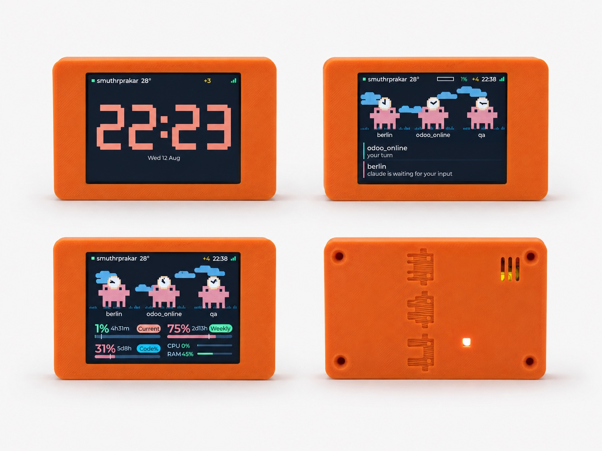
</p>

**สองค่านี้ตัดสินว่าจะออกมาสวยไหม** และไม่ใช่ค่าที่คนส่วนใหญ่นึกถึงก่อน — ตั้ง **perimeter 4-5 ชั้น
กับ top solid 5-6 ชั้น** เพราะผนังบางจะมีแสงจากจอลอดผ่านเนื้อพลาสติกตอนกลางคืน และเพิ่ม infill ไม่ช่วย
(40% พอแล้ว) ใช้เส้นสีเข้มช่วยได้ด้วยเหตุผลเดียวกัน

วางฝาหน้าคว่ำหน้าจอลงเตียงพิมพ์ ส่วนฝาหลังหงายด้านลายขึ้น — ก้นร่องที่เซาะลายเป็น top surface
ถ้าไม่ให้ solid layer พอ มันจะออกมาเป็นขนๆ

<p align="center">
  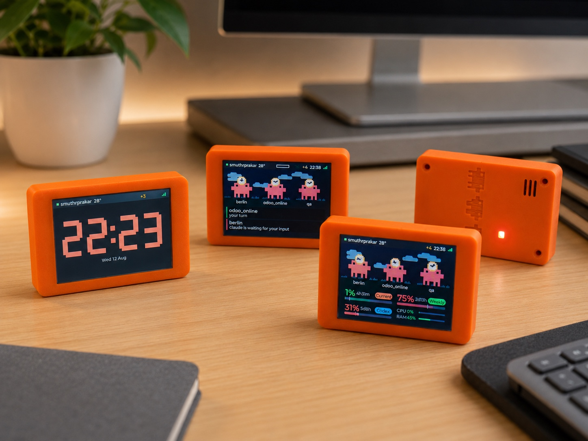
  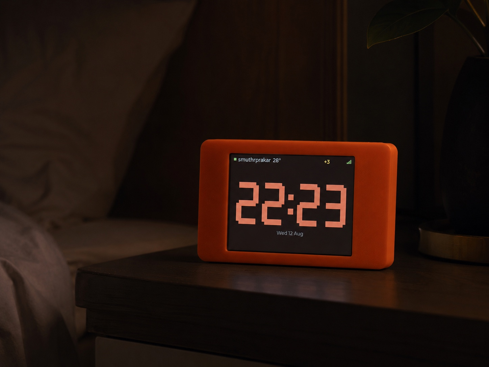
</p>

<sub>STL ชุดนี้คือชุดที่เราพิมพ์และลองประกอบเอง พอดีกับ ESP32-2432S028R ที่ระบุไว้ข้างบน
บอร์ดอื่นที่ใช้จอเดียวกันไม่รับประกันว่าจะพอดี</sub>

## 1. เอา repo กับคอมไพเลอร์ Swift มาก่อน

```bash
xcode-select --install
git clone https://github.com/zeuscs09/perch.git
cd perch
```

## 2. เอา firmware ลงบอร์ด

เสียบบอร์ดแล้วเก็บชื่อพอร์ตอนุกรมของมันไว้ในตัวแปร เพื่อให้คำสั่งข้างล่างก๊อปไปใช้ได้ตรงๆ:

```bash
PORT=$(ls /dev/cu.usbserial-* | head -1)
echo "$PORT"
```

ควรได้หนึ่งบรรทัด หน้าตาประมาณ `/dev/cu.usbserial-1420` — ตัวเลขท้ายต่างกันไปตามบอร์ดและตามพอร์ตที่เสียบ
ข้างล่างจึงไม่เขียนชื่อพอร์ตตรงๆ สักที่ ถ้าไม่ขึ้นอะไรเลยดูหัวข้อ [แก้ปัญหา](#แก้ปัญหา)

ตัวแปร `PORT` มีอยู่เฉพาะหน้าต่างเทอร์มินัลที่คุณพิมพ์ ถ้าเปิดหน้าต่างใหม่ต้องตั้งใหม่

### ทาง A — แฟลชไฟล์สำเร็จรูป (ไม่ต้องลง ESP-IDF)

โหลด `perch-esp32-*.bin` จาก
[release ล่าสุด](https://github.com/zeuscs09/perch/releases/latest) เป็นไฟล์เดียวราว 1 MB
รวม bootloader, partition table และตัวแอปไว้ครบแล้ว

```bash
python3 -m pip install esptool
python3 -m esptool --chip esp32 --port "$PORT" \
    write_flash 0x0 ~/Downloads/perch-esp32-1.0.4.bin
```

เท่านี้จบ — Python ราว 10 MB ไม่ต้องมีคอมไพเลอร์ ข้ามไปขั้นที่ 3 ได้เลย

### ทาง B — บิลด์เอง

เลือกทางนี้ถ้าอยากแก้ firmware เอง หรือบอร์ดของคุณต้องใช้ค่าจอคนละชุด

เครื่องมือสำหรับบิลด์:

```bash
brew install cmake ninja dfu-util python3
```

ESP-IDF — ตัวใหญ่สุด ราว 2 GB v5.5 คือตัวที่ firmware นี้บิลด์และทดสอบด้วย
ส่วน manifest ของคอมโพเนนต์รับตั้งแต่ 5.4 ขึ้นไป:

```bash
mkdir -p ~/esp && cd ~/esp
git clone -b v5.5 --recursive https://github.com/espressif/esp-idf.git
cd esp-idf && ./install.sh esp32
```

จากนั้นกลับมาที่ repo โหลด toolchain เข้าเชลล์แล้วแฟลช:

```bash
cd firmware
. $HOME/esp/esp-idf/export.sh
idf.py -p "$PORT" flash monitor
```

บรรทัด `export.sh` มีผลเฉพาะเชลล์ที่รัน ไม่ถาวร เปิดเทอร์มินัลใหม่ก็ต้องรันใหม่ บิลด์ครั้งแรกใช้เวลาหลายนาที
ถ้าติดขั้นตอนไหน เอกสาร
[getting started ของ Espressif](https://docs.espressif.com/projects/esp-idf/en/v5.5/esp32/get-started/)
คือตัวจริง

### ไม่ว่าจะทางไหน

จอจะติดและบอร์ดจะเริ่มประกาศตัวบน Bluetooth ในชื่อ `perch-3f7a` — ส่วนท้ายมาจาก MAC address
ของมัน จึงใช้แยกบอร์ดสองตัวออกจากกันได้ ถ้าเปิด `idf.py monitor` ค้างไว้จะเห็นตอนมันเกิดขึ้น
กด `Ctrl+]` เพื่อออก

## 3. ติดตั้งแอปบน Mac

```bash
cd ../host
./Scripts/make-app.sh --install
```

คำสั่งนี้บิลด์ `Perch.app` ก๊อปไป `/Applications` แล้วเปิดให้เลย macOS จะขอสิทธิ์ Bluetooth
ครั้งแรก — ต้องอนุญาต ไม่งั้นแอปจะมองไม่เห็นบอร์ดตลอดไป

ไอคอนมาสคอตเล็กๆ จะโผล่บนแถบเมนู คลิกเพื่อดูแผงโควตา คลิกรูปเฟืองเพื่อตั้งค่า
ท้ายแผงบอกว่าบอร์ดต่ออยู่หรือเปล่า และแต่ละ session กำลังทำอะไร

ตัวเลขข้างไอคอนคือโควตาของหน้าต่างปัจจุบัน และจะเปลี่ยนเป็นสีแดงเมื่อคุณใช้เร็วกว่าที่เวลาเดิน

## 4. ต่อเข้ากับ Claude Code

ทั้งหมดนี้อยู่ใน **เฟือง ▸ Settings… ▸ General**:

- **Install hooks in settings.json** — ตัวที่สำคัญที่สุด มันสอนให้ Claude Code
  บอกแอปว่ากำลังทำอะไรอยู่ ถ้าไม่กดอันนี้จอจะไม่มีอะไรขึ้นเลย ค่าที่คุณตั้งไว้เดิมยังอยู่ครบ
  และมีไฟล์สำรองเขียนไว้ข้างๆ ให้ด้วย
- **Board** — เลือกบอร์ดตามชื่อ หรือปล่อยไว้ที่ *Any board*
- **Brightness** — สไลเดอร์คุมไฟหลังจอ
- **Weather** — พิมพ์ชื่อเมือง กด Search แล้วเลือกจากรายการ ท้องฟ้าเหนือมาสคอตจะเดินตามของจริง
  ทั้งเมฆ ฝน หมอก และช่วงเวลาของวัน ถ้าไม่เปิดใช้ ฟ้าจะเป็นไล่เฉดเรียบๆ ที่ยังเปลี่ยนตาม
  เช้า/กลางวัน/เย็น/กลางคืนอยู่ดี
- **Launch at login** — ให้แอปเปิดรออยู่ก่อนเริ่มงาน

เปิด session ในเทอร์มินัลไหนก็ได้ — จะเป็น Claude Code, `codex` หรือ `agy` ก็ได้
ไม่เกินหนึ่งสองวินาทีจะมีอะไรเริ่มขยับ

## 5. โควตาบนจอ

แถบด้านล่างของจอมีสองท่อที่เป็นอิสระต่อกัน และเป็นทางเลือกทั้งคู่:

- **Read quota from the statusline** (Settings ▸ General) ติดตั้ง statusline ของ Claude Code
  ที่ส่งค่าการใช้งานปัจจุบันให้แอป ไม่ต้องใช้รหัสผ่านใดๆ แต่ค่าจะขยับเฉพาะตอนที่ Claude Code เปิดอยู่
- **Set session key…** (Settings ▸ General) ให้แอปถาม claude.ai ตรงๆ ตัวเลขจึงเดินต่อแม้ปิด Claude Code
  ไปแล้ว จากนั้น **Refresh quota** เลือกความถี่ (Off / 60s / 5 min)

> **เรื่อง session key** มันคือคุกกี้ `sessionKey` ของเบราว์เซอร์ที่ล็อกอิน claude.ai อยู่ และเป็น
> **รหัสผ่านระดับทั้งบัญชี** — ใครถือไปก็ทำอะไรในนามบัญชีคุณได้ แอปเก็บมันไว้ที่
> `~/.perch/session-key` โหมด 600 และไม่เคยใส่มันลงบรรทัดคำสั่ง ตัวแปรสภาพแวดล้อม
> หรือไฟล์ล็อก ถอนออกเมื่อไหร่ก็ได้ด้วยการลบไฟล์นั้น และเพิกถอนตัวคีย์ด้วยการล็อกเอาต์ claude.ai
> จากเบราว์เซอร์ที่คุณก๊อปมา ถ้าไม่สบายใจก็ข้ามไปได้ — ท่อ statusline ด้านบนก็มีตัวเลขให้ดูอยู่แล้ว
>
> วิธีเอามา: เปิด claude.ai ในเบราว์เซอร์ตอนล็อกอินอยู่ → DevTools → Application → Cookies →
> `claude.ai` → ก๊อปค่าของ `sessionKey`

การยึดช่อง statusline ไม่เปลี่ยนสิ่งที่คุณเห็น — คำสั่ง statusline เดิมของคุณได้ข้อมูลก้อนเดิมไปวาด
แล้วผลของมันถูกพิมพ์ออกไปตรงๆ ส่วนคนที่ไม่เคยมี statusline มาก่อน แอปจะวาดแบบนี้ให้ ชิ้นส่วน สี
และไฟล์ตั้งค่า `~/.claude/statusline-config.txt` ชุดเดียวกับ statusline ที่มากับ Claude Usage


## 6. Wi-Fi เพื่อให้จอรอดตอน Bluetooth หาย (ทางเลือก)

Bluetooth เป็นทางหลักและชนะเสมอ แต่มันก็หลุดได้ — คุณเดินผ่านบอร์ด Mac หลับไปครึ่งตัว
ซึ่งที่ผ่านมาแปลว่าจอค้าง เอาบอร์ดขึ้นเน็ตของคุณแล้วแอปจะป้อนต่อให้เองเมื่อ Bluetooth เงียบครบสิบวินาที

**เฟือง ▸ Settings… ▸ Wi-Fi** ตอนที่บอร์ดยังอยู่ในระยะ Bluetooth:

1. รายการทยอยขึ้นตามที่*บอร์ด*สแกนเจอ ไม่ใช่ที่ Mac เจอ สิ่งที่เห็นจึงเป็นวงที่บอร์ดเข้าถึงได้จริง
   บอร์ดรับได้แค่ 2.4GHz วงที่เป็น 5GHz ล้วนจะไม่โผล่
2. เลือกวง พิมพ์รหัส กด **Connect** ครั้งแรก macOS จะจับคู่กับบอร์ดเอง ไม่มีเลขหกหลักให้กรอก
3. จะขึ้น `Connected to <ชื่อวง>` พร้อมที่อยู่ของบอร์ด · บอร์ดจำได้ห้าวง และกลับขึ้นเน็ตเองหลังไฟดับ

ฝั่ง Mac ไม่ต้องตั้งอะไรเพิ่ม snapshot ถูกเข้ารหัสด้วย AES-256-GCM ด้วยกุญแจที่แอปสุ่มขึ้นเอง
แล้วผลักไปบอร์ดทางช่องที่เข้ารหัสอยู่แล้ว — ช่องเดียวกับรหัส Wi-Fi ของคุณ ส่วนการหาบอร์ดใช้ mDNS
ช่องกรอกที่อยู่ตรงท้ายแท็บมีไว้เผื่อเน็ตที่กรอง multicast เท่านั้น

บอร์ดยังไม่คุยกับ claude.ai อยู่ดี และ session key ไม่เคยออกจาก Mac

## แก้ปัญหา

**เสียบบอร์ดแล้วไม่มี `/dev/cu.usbserial-*`**
ส่วนใหญ่เป็นที่สาย — สาย micro-USB จำนวนมากต่อแต่ไฟ ไม่ต่อข้อมูล ถ้าไม่ใช่สาย ชิป USB-serial
ของบอร์ด (CH340) อาจต้องลงไดรเวอร์บน macOS รุ่นเก่า

**แฟลชแล้วค้างที่ "Connecting........"**
กดปุ่ม **BOOT** บนบอร์ดค้างไว้ สั่ง `idf.py flash` แล้วปล่อยตอนล็อกขึ้นคำว่า `Connecting`
และปิด serial monitor ที่ยังจับพอร์ตอยู่ด้วย

**จอติดแต่สีเพี้ยน หรือภาพกลับด้าน**
บอร์ดรุ่นนี้บางล็อตมาพร้อมจอคนละตัวกับที่ firmware นี้วัดค่าไว้ ให้รันโปรเจกต์ probe ใน
`firmware/probe/` เพื่ออ่านว่าจอของคุณตอบอะไรจริง แล้วแก้ค่าสองตัวที่ไม่ตรงใน
`firmware/main/pch_lcd.c` — ค่าของคำสั่ง `0x36` (MADCTL) สำหรับทิศทางและการกลับด้าน
และ `0x20` (ปิด inversion) กับ `0x21` (เปิด inversion) สำหรับสีที่กลับกัน

**บอร์ดไม่โผล่ในเมนู Board สักที**
เช็กว่าแอปได้สิทธิ์ Bluetooth ใน System Settings → Privacy & Security → Bluetooth
ว่าบอร์ดมีไฟเข้า และไม่มีอะไรอื่นต่ออยู่กับมัน — firmware รับการเชื่อมต่อได้ทีละหนึ่งเท่านั้น

**macOS ขอสิทธิ์ Bluetooth ใหม่ทุกครั้งที่บิลด์**
เป็นเรื่องปกติ แอปเซ็นแบบ adhoc ทุกการบิลด์จึงเป็นคนละตัวตนในสายตา macOS
ไม่มีทางเลี่ยงถ้าไม่มี Apple Developer ID

**มาสคอตไม่ขยับเลย**
น่าจะยังไม่ได้ติดตั้ง hook — Settings ▸ General → *Install hooks in settings.json*
session ที่เปิดค้างอยู่ก่อนหน้าจะยังใช้ค่าเดิม ให้เปิด session ใหม่ ส่วน *Open log* ในแท็บเดียวกัน
จะบอกว่าแอปได้รับอะไรมาบ้าง

**รายการ Wi-Fi ว่างเปล่า หรือสปินเนอร์หมุนไม่หยุด**
การตั้ง Wi-Fi เดินทางบน Bluetooth บอร์ดจึงต้องต่ออยู่ก่อน — ถ้าไม่ต่อ ในแท็บจะบอกไว้แล้ว
และรายการมีแต่วง 2.4GHz เท่านั้นเสมอ

**บอร์ดอยู่บนเน็ตและ ping ผ่าน แต่พอ Bluetooth หลุดจอก็ยังค้าง**
macOS 15 ขึ้นไปขอสิทธิ์ Local Network แยกอีกตัว และถ้าถูกปฏิเสธ ทั้ง mDNS และการต่อไปหา IP ตรงๆ
จะเงียบไปโดยไม่มี error ให้เห็นเลย ดูที่ System Settings ▸ Privacy & Security ▸ Local Network

## ข้อจำกัดที่รู้อยู่

- **macOS เท่านั้น** แอปที่คุยกับ Claude Code เป็นแอปแถบเมนูภาษา Swift ยังไม่มีตัวสำหรับ Linux หรือ Windows
- **ไม่มีอัปเดตผ่านอากาศ** firmware ตัวใหม่แปลว่าต้องเสียบสาย USB อีกครั้ง
- **ลำโพงยังไม่ได้ใช้** บอร์ดมีขาลำโพงมาให้ แต่ยังไม่ได้ต่ออะไรเข้าไป
- **เซ็นแบบ adhoc** แอปไม่ได้ notarise จึงเป็นของที่บิลด์ทีละเครื่อง ไม่ใช่ของที่ส่งต่อกันได้

## เครดิต

Perch แยกตัวออกมาจาก [TamaClaude](https://github.com/thaitop/tamaclaude) ของ Uthai Moolpak
ซึ่งเป็นที่มาของการปลุกบอร์ด ตัววาดสี่เหลี่ยม และโพรโทคอล BLE

ที่เปลี่ยนชื่อเพราะสิ่งที่มันทำห่างจาก "เลี้ยงสัตว์เลี้ยงเสมือน" ไปไกลมากแล้ว
ตอนนี้มันคือจอบอกสถานะ นาฬิกา และแผงพยากรณ์อากาศ ที่บังเอิญรู้ว่า agent ของเรากำลังทำอะไรอยู่

ส่วนที่แก้แล้วใช้ได้กับทั้งสองโครงการยังส่งกลับไปเป็น pull request ให้ต้นทางเหมือนเดิม

## สัญญาอนุญาต

MIT — ดู [LICENSE](LICENSE)
